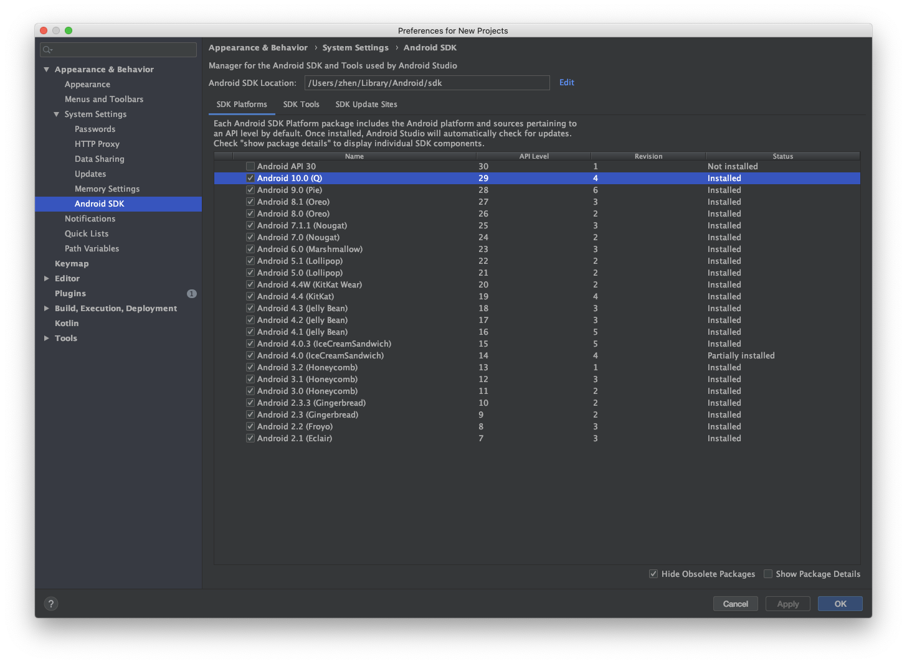
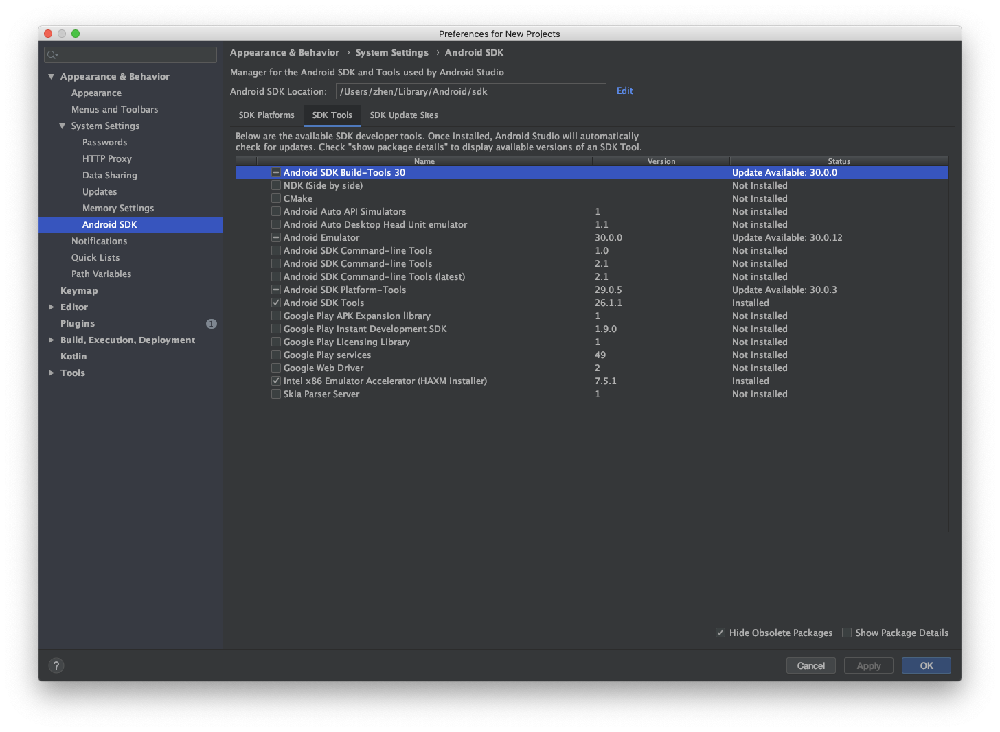
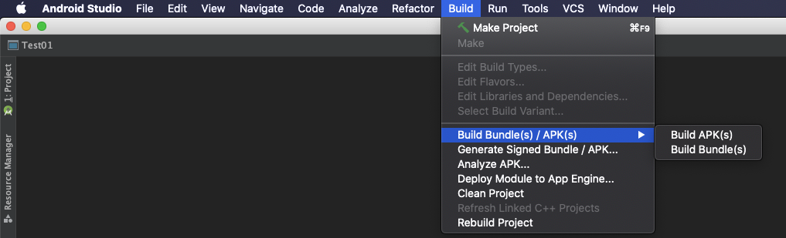
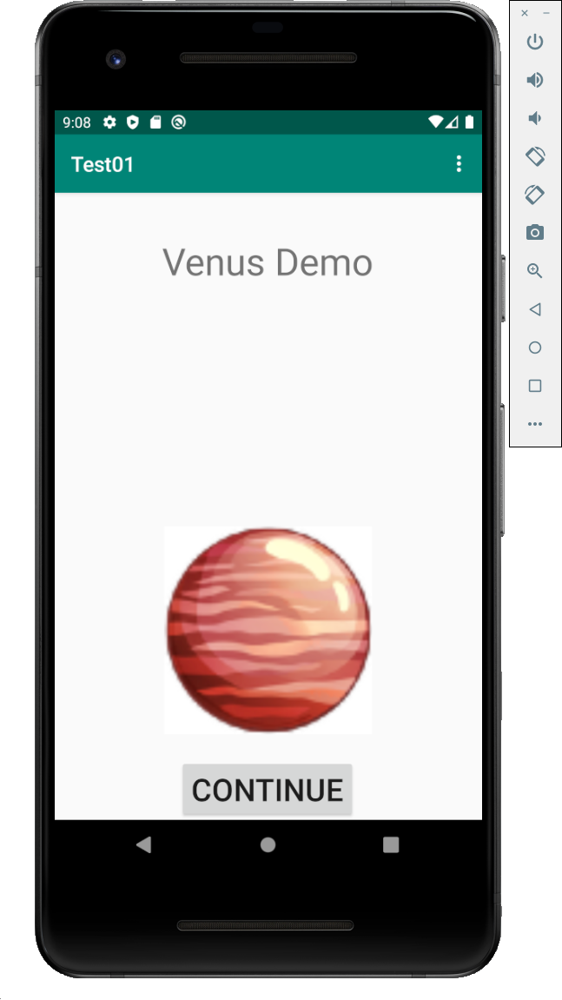

Android UI Reverse Tool
======

## Dependencies

Currently we are using [Poetry](https://python-poetry.org/)
to manage the Python dependencies.

Install and enter the virtual env:

```
poetry install
poetry shell
```

Create a link from poetry's virtual env to `.venv`
(if you are using VS code, it will automatically use this environment):

```
make link-venv
```

For java dependencies, see https://github.com/izgzhen/markii.

## Usage

```
python scripts/search-res-xml.py <jadx_apk_dir> <uix_path>
```

in which:

- `<jadx_apk_dir>`: Path to `jadx`-decompiled APK directory (See instructions below)
- `<uix_path>`: Path to the dynamically captured view hierarchy file (see instructions below)

## Running example

**Step 0**: Set up Android tools.

Download and install [Android Studio](https://developer.android.com/studio).
Install SDK and other tools: Click "Tools -> SDK Manager" in the top bar,
and you should select the following SDK tools to download (if you are using it the first time).
For SDK Platforms, you need at least "Android 10.0 (Q)".




After you select them, press "OK" to download them. It might take a while.
Also, note the "Android SDK Location" path in the above pop-up. We need to use it:
If you are using Mac, you should be able to find `~/Library/Android/sdk/platform-tools/`.
Add this directory to your `PATH` variable.

**Step 1**: Decompile an built app with `jadx`

Use Android Studio to open `tests/test01/app/` as an existing project.

Choose "Build APK" to build the APK.



The built APK file is in `tests/test01/app/build/outputs/apk/debug/app-debug.apk`.

Now, we use the `jadx` tool (https://github.com/skylot/jadx/) to decompile it to `/tmp/jadx_apk_dir`:

```
jadx tests/test01/app/build/outputs/apk/debug/app-debug.apk -d /tmp/jadx_apk_dir
```

**Step 2**: Capture view hierarchy

Follow the latest official guidance on set up an emulator device and run the testing app
on that device. When you can see the app running in the emulator device,
use `scripts/adb-uidump` tool to capture the view hierarchy as an XML file:



```
scripts/adb-uidump /tmp/uix.xml
```

**Step 3**: Run the reverse tool

```
python scripts/search-res-xml.py /tmp/jadx_apk_dir /tmp/uix.xml
```

You should see some outputs like:

```
WRAN: unknown prefix @android:id/button3
....

Solving...

Solve content
- FrameLayout
	|- ViewGroup
	|	|- LinearLayout
	|	|	|- ViewGroup
	|	|	|	|- TextView
	|	|	|	|- LinearLayoutCompat
	|	|	|	|	|- ImageView
	|	|- ViewGroup
	|	|	|- TextView
	|	|	|- ImageView
	|	|	|- Button
- LinearLayout
	|- RelativeLayout
	|	|- TextView
	|	|- TextView
	|- ImageView
Non-empty frag: /tmp/jadx_apk_dir/resources/res/layout/abc_popup_menu_item_layout.xml
Score: 0.6000000000000001
...
```

For each resource ID, e.g. `content` above, we want to *solve* its most likely corresponding
source XML fragment. The tree-structure printed below it is a simplified dynamic view hierarchy,
and the algorithm finds that the source fragment `/tmp/jadx_apk_dir/resources/res/layout/abc_popup_menu_item_layout.xml`
is mostly similar to that dynamic hierarchy with a score of approx. 0.6.

## Background Readings

- https://developer.android.com/studio/profile/hierarchy-viewer
- https://developer.android.com/guide/topics/ui/declaring-layout
